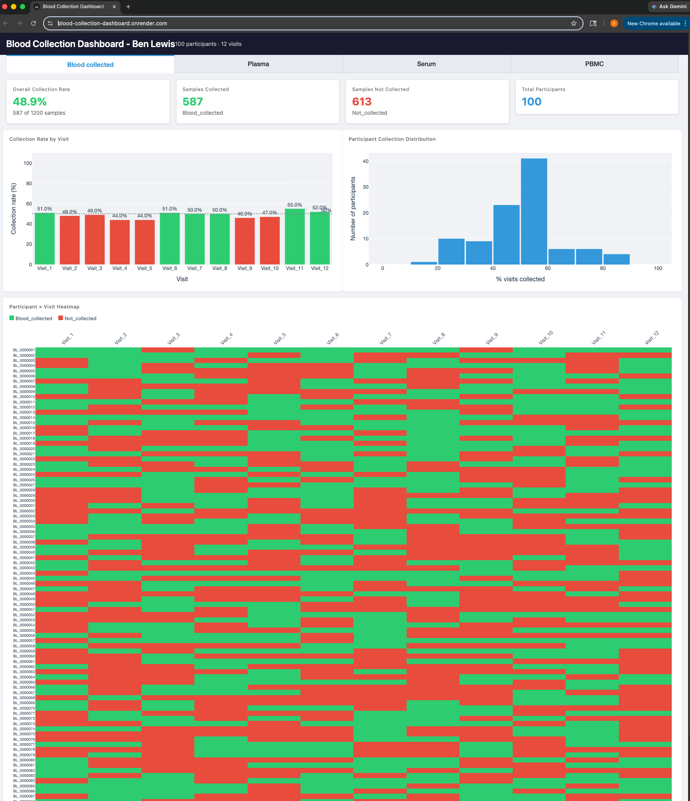

# Blood Collection Dashboard

Config-driven Plotly Dash web application for monitoring biomarker collection progress in a simulated clinical trial.



## Overview

This dashboard tracks sample collection rates across multiple derived biomarker types (blood, plasma, serum, PBMC) for a simulated 100-participant clinical trial cohort. Derived datasets (plasma, serum, PBMC) are constrained so that collection is only possible at visits where the primary blood sample was collected.

Each biomarker type is presented in its own tab with:

- **KPI metric cards** -- overall collection rate, samples collected, samples not collected, total participants
- **Per-visit bar chart** -- collection percentage per visit with a 50% threshold reference line
- **Participant distribution histogram** -- spread of collection rates across the cohort
- **Participant-by-visit heatmap** -- full grid showing collection status for every participant at every timepoint

## Tech Stack

| Package | Version |
|---|---|
| Dash | 4.1.0 |
| Dash Bootstrap Components | 2.0.4 |
| Plotly | 6.6.0 |
| Pandas | 2.3.3 |
| PyYAML | 6.0.3 |

## Setup

```bash
pip install -r requirements.txt
```

## Data Generation

Generate simulated datasets with seeded randomness for reproducibility:

```bash
python scripts/generate_data.py
```

This creates four CSVs in `output_files/`:

| File | Description |
|---|---|
| `blood_collected_at_visit.csv` | Primary blood collection (source dataset) |
| `blood_plasma_processed.csv` | Plasma processing, constrained to collected blood visits |
| `blood_serum_processed.csv` | Serum processing, constrained to collected blood visits |
| `blood_pbmc_processed.csv` | PBMC processing, constrained to collected blood visits |

The source dataset (`is_source: true` in config) is generated first. A source mask records which participant-visit combinations had blood collected, and derived datasets are constrained so that collection can only occur where the mask is `True`.

## Running the App

```bash
python app_dash.py
```

The dashboard launches at `http://localhost:8050` by default.

## Config-Driven Architecture

The entire application is driven by `config/config.yaml`. No code changes are required to:

- **Add or remove datasets** -- define a new entry under `input_datas` with a CSV path, column mappings, and collected/not-collected value labels
- **Change the cohort** -- adjust `num_participants` and `participant_id_prefix`
- **Customize the UI** -- modify color schemes, chart dimensions, heatmap row heights, fonts, and font sizes
- **Set source constraints** -- mark one dataset as `is_source: true` to control which visits are available for derived datasets

### Config Structure

```yaml
blood_collection_dash_app:
  title: "Blood Collection Dashboard - Ben Lewis"
  num_participants: 100
  participant_id_prefix: "BL_"

  input_datas:
    blood_collection_data:
      is_source: true
      label: "Blood collected"
      csv_file_path: "output_files/blood_collected_at_visit.csv"
      participant_id_col: "pseudo_ID"
      values:
        collected: "Blood_collected"
        not_collected: "Not_collected"
      random_seed: 42
    # ... additional datasets

  colors:
    collected: "#2ecc71"
    not_collected: "#e74c3c"
    # ...

  charts:
    heatmap_row_height: 14
    bar_height: 360
    # ...
```

## Deployment

The app is Heroku-ready with a `Procfile` included. It reads `PORT` from the environment or defaults to `8050`.

```bash
heroku create
git push heroku main
```

## Project Structure

```
blood_collection_dashboard/
├── app_dash.py               # Main Dash application
├── config/
│   └── config.yaml           # All app configuration
├── scripts/
│   └── generate_data.py      # Simulated data generation
├── output_files/             # Generated CSV datasets
├── requirements.txt
├── Procfile
└── LICENSE
```

## License

See [LICENSE](LICENSE) for details.
